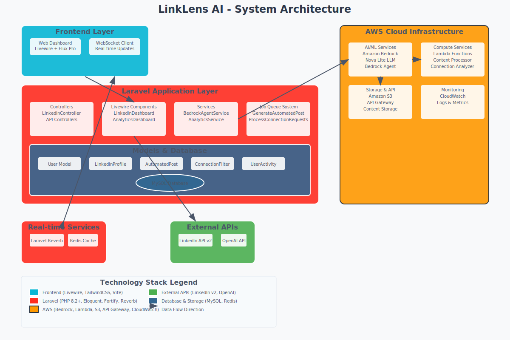

# LinkLens AI - Architecture Documentation

## 📋 Architecture Overview

LinkLens AI is a sophisticated LinkedIn automation platform that leverages AWS AI services to provide intelligent content generation and connection management. The system follows a modern microservices architecture with clear separation of concerns.

## 🏗️ System Architecture

### Architecture Diagram


For detailed Mermaid diagram, see: [architecture-diagram.md](./architecture-diagram.md)

## 🔧 Technology Stack

### **Frontend Layer**
- **Livewire 3.x** - Full-stack reactive framework
- **Livewire Flux Pro** - Premium UI components
- **TailwindCSS 4.0** - Utility-first CSS
- **Vite** - Modern build tooling
- **Alpine.js** - Lightweight JavaScript framework

### **Application Layer (Laravel 12.0)**
- **PHP 8.2+** - Modern PHP runtime
- **Eloquent ORM** - Database abstraction
- **Laravel Fortify** - Authentication system
- **Laravel Reverb** - WebSocket server
- **Queue System** - Background job processing

### **AWS Cloud Services**
- **Amazon Bedrock** - AI/ML service with Nova Lite LLM
- **AWS Lambda** - Serverless compute functions
- **Amazon S3** - Object storage for content and analytics
- **API Gateway** - RESTful API management
- **CloudWatch** - Monitoring and logging

### **External Integrations**
- **LinkedIn API v2** - Social media automation
- **OAuth 2.0** - Secure authentication
- **OpenAI API** - Backup AI service (optional)

### **Database & Storage**
- **MySQL** - Primary relational database
- **Redis** - Caching and session storage (optional)
- **Amazon S3** - Cloud object storage

## 🔄 Data Flow Patterns

### 1. **AI Content Generation Flow**
```
User Request → Laravel Job Queue → BedrockAgentService → Amazon Bedrock Nova → Generated Content → LinkedIn API → Published Post
```

### 2. **Smart Connection Processing Flow**
```
LinkedIn Connection Request → Background Job → AI Analysis (Bedrock) → Accept/Reject Decision → LinkedIn API Response
```

### 3. **Real-time Updates Flow**
```
Background Event → Laravel Broadcasting → Reverb WebSocket → Frontend Update
```

### 4. **Analytics Data Flow**
```
LinkedIn API Data → Analytics Service → MySQL Storage → S3 Backup → Dashboard Visualization
```

## 🛡️ Security Architecture

### **Authentication & Authorization**
- OAuth 2.0 with LinkedIn
- Laravel Fortify authentication
- Two-factor authentication support
- JWT token management

### **Data Protection**
- Encrypted token storage
- CSRF protection
- SQL injection prevention
- Input validation and sanitization
- Rate limiting and throttling

### **AWS Security**
- IAM roles and policies
- VPC security groups
- Encrypted S3 storage
- CloudWatch security monitoring

## 📊 Performance & Scalability

### **Performance Optimizations**
- Queue-based background processing
- Real-time WebSocket updates
- Database query optimization
- CDN-ready asset compilation
- Intelligent caching strategies

### **Scalability Features**
- Serverless Lambda functions
- Auto-scaling queue workers
- Cloud-native storage (S3)
- Microservices architecture
- Event-driven design patterns

## 🚀 Deployment Architecture

### **Local Development**
- Laravel Herd environment
- Vite development server
- MySQL/SQLite database
- Queue worker processes

### **Production (AWS)**
- EC2 or ECS containers
- RDS MySQL database
- ElastiCache Redis
- CloudFront CDN
- Application Load Balancer

## 📈 Monitoring & Observability

### **Application Monitoring**
- Laravel logs and error tracking
- User activity logging
- Performance metrics
- Queue job monitoring

### **AWS Monitoring**
- CloudWatch logs and metrics
- Lambda function monitoring
- S3 access logging
- Bedrock usage tracking

## 🔌 API Architecture

### **Internal APIs**
- RESTful Laravel controllers
- Livewire component actions
- Real-time WebSocket events
- Background job dispatching

### **External APIs**
- LinkedIn API v2 integration
- AWS Bedrock model invocation
- Lambda function triggers
- S3 storage operations

## 📱 Component Architecture

### **Frontend Components**
- `LinkedinDashboard` - Main automation interface
- `AnalyticsDashboard` - Performance insights
- `AutomationHistory` - Activity tracking
- `Settings` - Configuration management

### **Backend Services**
- `BedrockAgentService` - AI integration
- `LinkedinController` - OAuth handling
- `AnalyticsService` - Data processing
- `UserActivityService` - Audit logging

### **Background Jobs**
- `GenerateAutomatedPost` - Content creation
- `ProcessConnectionRequests` - Smart filtering
- `AnalyticsProcessor` - Data aggregation
- `TokenRefreshJob` - OAuth maintenance

This architecture ensures scalability, security, and maintainability while leveraging modern cloud-native technologies for optimal performance.